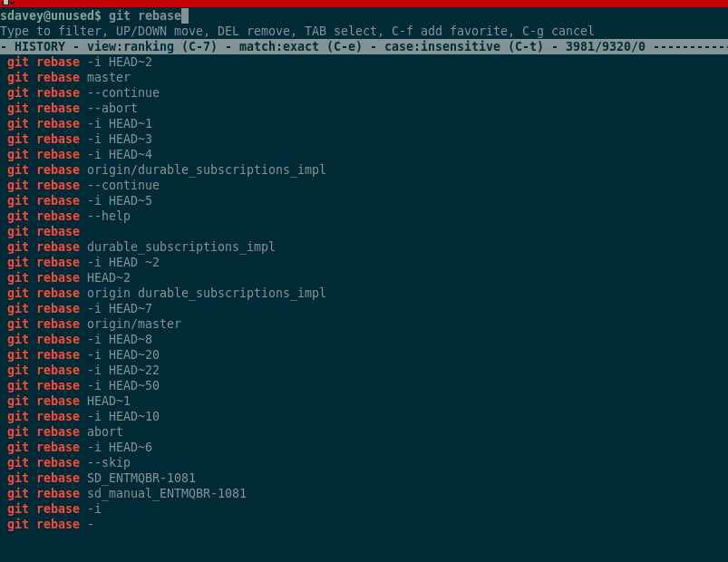

Recently, Ive found a pretty amazing tool available for free on github, that changes the way whole way I work in the command
line, and lets face it, when you find something this good, you have to share it right?
Its one of the first things I install when working with a new linux system, vm or laptop. Absolutely changing the "history"
or "ctrl + r" usage of the old and ancient. 

If youre ever searching through your history for the obscure command you used 3 months ago, while deep in the middle of coding
nirvana, (read - desperately scanning stackoverflow ) or that you "won't need it enough to save as an alias", but in reality use that command a few times per week... then have a look here...

https://github.com/dvorka/hstr

installation is incredibly simple, with all methods to install listed in the README of the github page, so... what does it do?

If youve ever searched through your history with ..

`history | grep -i <my_command_here>` or `<Ctrl+r> my_command_here <Ctrl+r> <Ctrl+r> <Ctrl+r>` ....

with 'histr' you can now type `hstr` or `<Ctrl+r>` once, type some part of the command you are searching for... and this is the result...

the results list is reponsive in real time, can be edited and is listed in ascending order, meaning that the commands you use
the most that match your search will be at the top, you can just scroll down the list, press `Enter` or `right key` and it will be on your command line instantly. This WILL speed up your daily work so much, believe me!

Thats it. See you. 
